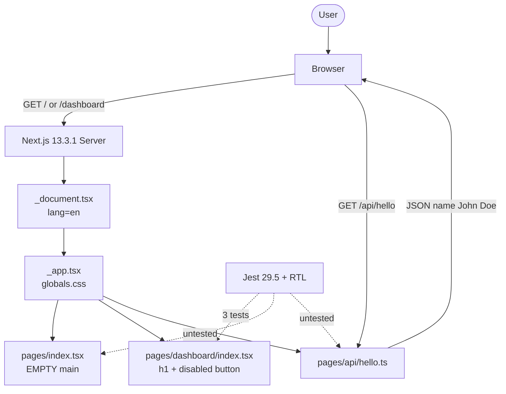

# 🧪 test-demo

[](./package.json)
[](https://nextjs.org/)
[](https://www.typescriptlang.org/)
[](https://tailwindcss.com/)
[](https://jestjs.io/)
[](#-test-status)
[](#-test-status)
[](#-security-status)
[](https://opensource.org/licenses/MIT)
[](https://nodejs.org/)

Next.js **Pages Router** demo (`v0.1.0`) — TypeScript, Tailwind, Jest. Analysis snapshot: **2026-08-20**.

> **CRITICAL:** 25 npm vulnerabilities — **3 critical**, **12 high**, 8 moderate, 2 low. Do **not** ship to production until patched. See [Security Status](#-security-status).

---

## Tech Stack

| Layer | Technology | Version | Role |
| --- | --- | --- | --- |
| Framework | [Next.js](https://nextjs.org/) | 13.3.1 | Pages Router, SSR, API routes |
| UI | [React](https://react.dev/) | 18.2.0 | View layer |
| Language | [TypeScript](https://www.typescriptlang.org/) | 5.0.4 | `strict: true` |
| Styles | [Tailwind CSS](https://tailwindcss.com/) | 3.3.1 | Utility CSS + PostCSS 8.4.23 |
| Unit tests | [Jest](https://jestjs.io/) | 29.5.0 | `jest-environment-jsdom` |
| Assertions | [Testing Library](https://testing-library.com/) | RTL 14.0.0 / jest-dom 5.16.5 | DOM queries |
| Lint | ESLint + `eslint-config-next` | 8.39.0 / 13.3.1 | Next.js rules |
| Runtime types | `@types/node` | 18.16.0 | Node 18 target |

---

## Architecture

| Concern | Choice |
| --- | --- |
| Router | **Pages Router** (`src/pages/`) — no App Router `/app` |
| Layout | `_document.tsx` → `_app.tsx` → page |
| API | Next.js API route `/api/hello` |
| Aliases | `@/*` → `./src/*` · `@Pages/*` → `./src/pages/*` |
| State | None (local JSX only) |
| Components | `src/components/` **missing** |
| Archetype | Thin BFF-MVC — no service layer |



---

## Project Structure

```text
test-demo/
├── public/                      # static assets
├── src/
│   ├── pages/
│   │   ├── _app.tsx             # global CSS + page wrapper
│   │   ├── _document.tsx        # HTML shell, lang=en
│   │   ├── index.tsx            # /  — empty <main>
│   │   ├── dashboard/
│   │   │   └── index.tsx        # /dashboard
│   │   └── api/
│   │       └── hello.ts         # GET /api/hello
│   ├── styles/
│   │   └── globals.css          # Tailwind + CSS vars; no .blue
│   └── components/              # NOT CREATED
├── test/
│   └── pages/
│       └── index.test.tsx       # 3 dashboard smoke tests
├── coverage/                    # jest --coverage output
├── jest.config.mjs
├── next.config.js               # reactStrictMode: true
├── tailwind.config.js
├── tsconfig.json                # paths: @/*, @Pages/*
└── package.json                 # v0.1.0
```

---

## Key Findings

| Finding | Severity | Evidence |
| --- | --- | --- |
| Empty `index.tsx` | HIGH | `<main>` has no content, no nav, no SEO; Inter imported but unused |
| Missing `.blue` CSS | MEDIUM | Dashboard `className="blue"` — not in `globals.css` or Tailwind utilities |
| 25 security vulns | CRITICAL | npm audit: 3 critical, 12 high, 8 moderate, 2 low |
| Dashboard quality **3/10** | HIGH | Unstyled `.blue`, disabled button with no `aria-label`, no typed props |
| Tests cover dashboard only | HIGH | 3 tests; `/`, `/api/hello`, `_app`, `_document` uncovered |
| No `src/components/` | LOW | No reusable UI |
| Coverage below 80% | HIGH | Bradesco/Avanade gate not met |

---

## Prerequisites

| Requirement | Version |
| --- | --- |
| Node.js | ≥ 18.0.0 |
| npm | 9+ (lockfile present) |
| OS | Windows / macOS / Linux |

---

## Quick Start

```bash
git clone <repository_url>
cd test-demo
npm install
npm run dev          # http://localhost:3000
```

| Script | Command | Purpose |
| --- | --- | --- |
| Dev | `npm run dev` | Next.js dev server (`localhost:3000`) |
| Build | `npm run build` | Production bundle |
| Start | `npm start` | Serve production build |
| Lint | `npm run lint` | `next lint` |
| Test | `npm run test` | Jest watch mode |
| Coverage | `npm run coverage` | Jest + `coverage/` (lcov, clover, JSON) |

| Route | File | Status |
| --- | --- | --- |
| `/` | `src/pages/index.tsx` | Empty `<main>` |
| `/dashboard` | `src/pages/dashboard/index.tsx` | Heading, disabled button, unstyled `.blue` |
| `/api/hello` | `src/pages/api/hello.ts` | `{ "name": "John Doe" }` |

---

## Test Status

[](#-test-status)
[](#-test-status)
[](#-test-status)
[](#-test-status)

| Suite | File | Count | Result |
| --- | --- | --- | --- |
| Dashboard render | `test/pages/index.test.tsx` | 1 | Heading `Hello World :D` |
| Disabled button | same | 1 | `toBeDisabled()` |
| Blue paragraph | same | 1 | `data-testid="paragraph-blue"` + class `blue` |
| **Total** | | **3** | Dashboard only |

| Target | Covered |
| --- | --- |
| `pages/dashboard/index.tsx` | Yes |
| `pages/index.tsx` | No |
| `pages/api/hello.ts` | No |
| `pages/_app.tsx` | No |
| `pages/_document.tsx` | No |
| `src/components/` | N/A (missing) |

Gaps: no axe/a11y, no snapshots, no API mocks, no `@testing-library/user-event`, no `jest.setup.js`. Alias `@Pages/dashboard` depends on `next/jest` mapping (no explicit `moduleNameMapper`).

---

## Security Status

```text
████████████████████  CRITICAL  ████████████████████
  25 vulnerabilities — 3 critical · 12 high · 8 moderate · 2 low
  15 (critical + high) block production deployment
  Scan: npm audit · 2026-08-20
```

| Severity | Count | Examples | Action |
| --- | --- | --- | --- |
| Critical | 3 | `next`, `react-dom` (audit) | Upgrade immediately |
| High | 12 | `ws` (DoS / memory), `yaml` | Patch or upgrade |
| Moderate | 8 | `yaml` stack overflow | `yaml` ≥ 1.10.3 |
| Low | 2 | Transitive | Track |

| CWE | Class |
| --- | --- |
| CWE-400 | Resource exhaustion |
| CWE-476 | Null pointer dereference |
| CWE-770 | Unbounded allocation |
| CWE-674 | Uncontrolled recursion |
| CWE-908 | Uninitialized resource |
| CWE-1050 | Excessive thread count / DoS |

```bash
npm audit
npm audit fix              # safe patches
# npm audit fix --force    # last resort — review breaking changes
```

Upgrade path: Next.js **13.3.1 → 14.x/15.x** · React **18.2.0 → 18.3+** · TypeScript **5.0.4 → 5.5+** · Tailwind **3.3.1 → 3.4+**.

---

## Code Quality

| File | Type | Lines | Score | Issues |
| --- | --- | --- | --- | --- |
| `pages/index.tsx` | Page `/` | 11 | **2/10** | Empty `<main>`; unused Inter; no SEO/nav |
| `pages/dashboard/index.tsx` | Page `/dashboard` | 13 | **3/10** | Missing `.blue`; disabled button, no `aria-label`; no exported types |
| `pages/_app.tsx` | Wrapper | 8 | **9/10** | Standard; imports `globals.css` |
| `pages/_document.tsx` | Document | 12 | **9/10** | Standard; `lang="en"` |
| `pages/api/hello.ts` | API | 15 | **5/10** | Hardcoded payload; no validation/error handling |
| `src/styles/globals.css` | CSS | — | **6/10** | Tailwind + CSS vars; **no `.blue`** |
| `test/pages/index.test.tsx` | Test | — | **6/10** | 3 smokes; `@Pages/*`; no API mock |

**Weighted snapshot:** wrappers are fine; product pages and security are not. Dashboard **3/10**. Coverage **&lt; 80%**.

Positive: `strict: true`, `data-testid` on dashboard, `reactStrictMode: true`.

---

## Recommendations

### Immediate

| # | Action |
| --- | --- |
| 1 | Fill or redirect empty `index.tsx` (content + SEO + nav) |
| 2 | Define `.blue` in `globals.css` **or** use `text-blue-500` / `bg-blue-500` |
| 3 | `npm audit fix`; plan Next/React upgrades |
| 4 | Create `src/components/` |
| 5 | Tests for `/`, `/api/hello`; add `aria-label` on disabled button |

### Medium-term

| # | Action |
| --- | --- |
| 1 | Next.js 14+ · TypeScript 5.5+ · Tailwind 3.4+ |
| 2 | App Router migration plan (optional) |
| 3 | `jest-axe` + snapshots · `@testing-library/user-event` |
| 4 | Explicit Jest `moduleNameMapper` for `@Pages/*` |
| 5 | `noUnusedLocals` / `noUnusedParameters`; bump `target` off `es5` |

### Long-term

| # | Action |
| --- | --- |
| 1 | App Router if SSR/streaming matters |
| 2 | Service layer (hexagonal / clean architecture) |
| 3 | CI: lint + test + coverage ≥ 80% + `npm audit` gate |
| 4 | E2E (Playwright or Cypress) |

---

## Contributing

See [CONTRIBUTING.md](../CONTRIBUTING.md) (when published). Until then:

1. Branch from `main`
2. `npm run lint` and `npm run coverage` before PR
3. Conventional commits: `feat|fix|docs|refactor|test(scope): message`

---

## License

[](https://opensource.org/licenses/MIT)

**MIT** © 2023 [Samuel_Ricardo](../LICENSE)

```text
Copyright (c) 2023 Samuel_Ricardo
```
